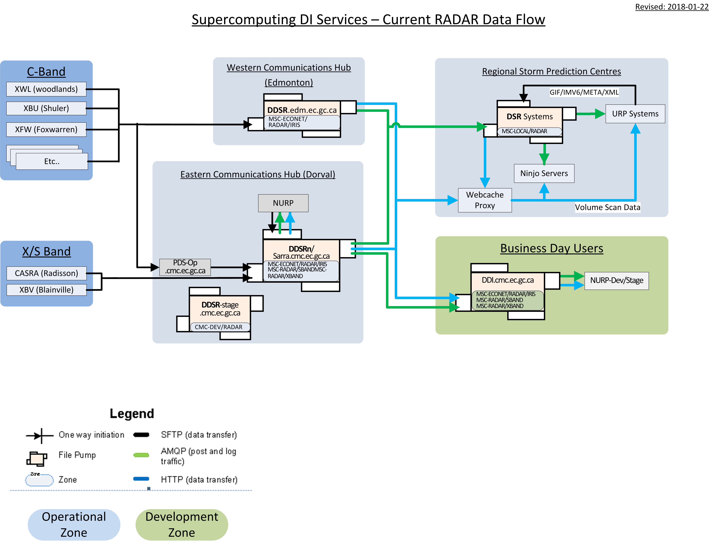

Deployment Status 2018
----------------------

The slide below corresponds to deployed data flows in support of Environment Canada, mostly
for operational weather forecasting, in place in January 2018.

.. image:: E-services_data-volume_pas.png

Sarracenia is being used operationally to acquire about four terabytes observations from automated weather 
observing systems, Weather RADARS which deliver data directly to our hubs, international peer operated public 
file services, which provide satellite imagery and numerical products from other national weather centres.

Within the main high performance computing (HPC) data centre, there are two supercomputers, two site stores, 
and two pre and post processing clusters. Should a component in one chain fail, the other can take over. The input
data is sent to a primary chain, and then processing on that chain is mirrored, using sarracenia to copy
the data to the other chain. That´s about 16 of the 25 terabytes of the data centre traffic in this diagram.

A distillation of the data acquired, and the analysis and forecasts done in HPC, is the seven terabytes
at the top right, that is sent to the seven regional Storm Prediction Centres (SPC´s.)

The products of the SPC´s and the central HPC are then shared with the public and partners in industry, academia,
and other governements.

RADAR Data Flows
----------------

If we begin with RADAR data acquisition as an example, individual RADAR systems use FTP and/or SFTP to send files
to eastern and western communications hubs. Those hubs run the directory watching component (sr_watch) and
determine checksums for the volume scans as they arrive. The Unified RADAR Processing (URP) systems are sr_subscribed
to one hubs, listening for new volume scans, and download new data from the hubs as soon as they are posted.
URP systems then derive new products and advertise them to the local hub using the sr_post component.

In regional offices, the NinJo visualization servers download volume scans and processed data from URP 
using identical subscriptions, pulling the data from whichever national hub makes the data available first.
The failure of a national hub is transparent for RADAR data in that the volume scans will be downloaded
from the other hub, and the other URP processor will produce the products needed.

Each site has multiple ninjo servers. We use http-based file servers, or web accessible folders to serve data. 
This allows easy integration of web-proxy caches, which means that only the first ninjo server to request data 
will download from the national hub. Other Ninjo servers will get their data from the local proxy cache.
The use of Sarracenia for notifications when new products are available is completely independent of the 
method used to serve and download data. Data servers can be implemented with a wide variety of tools
and very little integration is needed.  

HPC Mirroring
-------------

All through 2017, work was proceeding to implement high speed mirroring between the supercomputer site stores
to permit failover. That work is now in a final deployment phase, and should be in operations by spring 2018.
For more details see: `HPC Mirroring Use Case <mirroring_use_case.html>`_

Application Changes in 2017
---------------------------

Expanded use cases explored:

* mirroring.  Formerly tool was used for raw data dissemination without regard for permissions, ownership, symbolic links, etc...
For the mirroring use case, exact metadata replication was a suprisingly complex requirement.

* C-implementation:  In exploring mirroring, it became obvious that for sufficiently large trees ( 27 
Million files), the only practical method available was the use of a C shim library.  Having all user codes invoke
a python3 script, is complete nonsense in an HPC environment, so it was necessary to implement a C version of sarracenia
posting code for use by the shim library.  Once the C implementation was begun it was only a little additional work
to implement a C version of sr_watch which was much more memory and cpu efficient than the python original.

* node.js implementation:  A client of the public datamart decided to implement enough of sarracenia to download
warnings in real-time.

* end-user usage:  All of the deployments thus far are implemented by analysts with a deep understanding of Sarracenia,
and extensive support, and background.  This year, we went through several iterations of having users deploy their flows,
collecting feedback, and then making it easier end users at the the next iteration. Many of these changes were *breaking*
changes, in that options and ways or working were still prototypes and required revision.

Changes:

   - exchanges were an administrator-defined resource.  Now users can declare their own.
   - One had to look on web sites for find examples.  Now the *list* command shows many examples included with the package.
   - It was hard to find where to put settings files.  The *edit* command helps with that.
   - Different variables were available in different plugins.  Now they are the same.
   - partitioning specifications were arcane.  replaced with the *blocksize* option, which has only three possibilities: 0,1,many.
   - Users needed to understand routing across multiple pumps, which was quite complex.  Now optional, with good defaults, 
     so uses can usually ignore it. 
   - an improved plugin interface is available to have multiple routines that work together specified in a single plugin.

These changes were confusing for the expert analysts, as significant changes in details occurred across versions
in 2017, in the name of more consistency, and a cleaner interface.

Coming in 2018
--------------

As of release 2.18.01a5, the first good relase of 2018, all of the use cases targetted have been explored
and reasonable solutions are available, so there should be no further changes to the existing configuration language or options.
No changes to existing configuration settings are to be done. Additions are still coming, but not at the cost
of breakage of any existing configurations.  Even those additions are relatively minor, as the core application
is now feature complete.

Expect 2.18.01a5 to be the last alpha release of the package and for subsequent work to be on a beta version
with a target of a much more long-lived stable version some time in 2018.  

- HPC mirroring use case will be completed.

- improve deployment consistency: Currently, different deployments use different operational versions, as the package
was evolving for new cases continuously. In 2018, we will revisit early deployments to bring them uptodate.

- more examples, and documentation: Incorporation of mirroring plugins into provided examples.

- reporting. While reporting was baked in from the start, it proved to be very expensive, and so deployments to date
have omitted reporting. Now that deployments loads are quieting down, this year should allow us to add real-time report
routing to deployed configurations.  There is no functionality to develop, as everything is already in the application,
but mostly not used. Use may uncover additional issues.

- pluggable checksum algorithms. Currently checksum algorithms are baked into the implementations. There is a need
to support plugins to support user-defined checksum algorithms.

- deployment of additional instances:  flux.weather.gc.ca, hpfx.collab.science.gc.ca, etc...
  
- introduction to end users of stable version.

