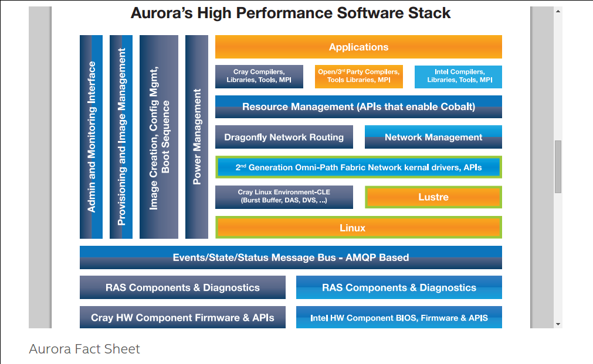

==============================
 AMQP - Primer for Sarracenia
==============================

Scope
-----

- AMQP is a vast and interesting topic in it's own right.
  Not trying to explain all of it here.
- Introduce only concepts needed to use Sarracenia.
- More resources: metpx.sourceforge.net/#amqp
- or just Google AMQP, rabbitmq.

Why Use AMQP?
-------------

 - open standard, robust adoption.
 - low latency message passing.
 - encourages asynchronous patterns/methods.
 - language, protocol & vendor neutral.
 - very reliable.

Where does AMQP Come From?
--------------------------

- Open International standard from financial world.
- mostly used behind the scenes, server-side processing, not user visible.
- many web companies (soundcloud) 
- seeing good adoption in monitoring and integration for HPC

Intel/Cray HPC Stack
--------------------

`Intel/Cray HPC stack <http://www.intel.com/content/www/us/en/high-performance-computing/aurora-fact-sheet.html>`_ 

OpenStack
---------

`AMQP is the messaging technology chosen by the OpenStack cloud. <http://docs.openstack.org/developer/nova/rpc.html>`_

.. image:: OpenStackArch.png

Concepts
--------

.. image:: AMQP4Sarra.svg

- an AMQP Server is called a Broker. *Broker* is sometimes used to refer to the software,
  other times server running the broker software (same confusion as *web server*.)
 
- There are many different broker software implementations. We use rabbitmq. 
  Not trying to be rabbitmq specific, but management functions differ between implementations.
  So admin tasks require 'porting' while the main application elements do not.

- queues are usually taken care of transparently, but you need to know
   - A Consumer/subscriber creates a queue to receive messages.
   - Consumer queues are *bound* to exchanges (AMQP-speak) 

- An exchange is a matchmaker between producers and consumer queues.
   - A message arrives from a publisher. 
   - message goes to the exchange, is anyone interested in this message?
   - in a topic exchange, the topic is the message exchange key.
   - interested: compare message key to the bindings of consumer queues.
   - message is routed to interested consumer queues, or dropped if there aren't any.
   
- Multiple processes can share a queue, they just take turns removing messages from it.
   - This is used heavily for sr_sara and sr_subcribe multiple instances.

- Queues can be 'durable', so even if your subscription process dies, 
  if you come back in a reasonable time and you use the same queue, 
  you will not have missed any messages.

- How to Decide if Someone is Interested.
   - For Sarracenia, we use (AMQP standard) Topic based Exchanges.
   - Subscribers indicate what topics they are interested in, and the filtering occurs server/broker side.
   - Topics are just keywords separated by a dot. wildcards: # matches anything, * matches one word.
   - We create the topic hierarchy from the path name (mapping to AMQP syntax)
   - Resolution & syntax of server filtering is set by AMQP. (. separator, # and * wildcards)
   - Server side filtering is coarse, messages can be further filtered after download using regexp on the actual paths (the reject/accept directives.)

- topic prefix?  We start the topic tree with fixed fields
     - v02 the version/format of sarracenia messages.
     - post ... the message type, this is an announcement 
       of a file (or part of a file) being available.  

AMQP and Sarracenia
-------------------

Sarracenia is only a light wrapper/coating around AMQP.  

- In sarracenia, we run a web server (apache), sftp server (openssh), and amqp broker (rabbitmq)
  on the same user-facing address.  

- AMQP is very powerful, only need application logic.

- Wherever reasonable, we use their terminology and syntax. 
  If someone knows AMQP, they understand. If not, they can research.
  - Users configure a *broker*, instead of a pump.
  - users explicitly can pick their *queue* names.
  - users set *subtopic*, 
  - topics with dot separator are minimally transformed, rather than encoded.
  - queue *durable*. 
  - we use *message headers* (AMQP-speak for key-value pairs) rather than encoding in JSON or some other payload format.

- reduce complexity through conventions.
   - use only one type of exchanges, take care of bindings.
   - naming conventions for exchanges and queues.
      - exchanges start with x. 
        - xs_Weather - the exchange for the source (amqp user) named Weather to post messages
        - xpublic -- exchange used for most subscribers.
      - queues start with q

- Internet resources are more useful and reduce our documentation burden.
- We write less code (exposing raw AMQP means less glue.)
- Less potential for bugs/ higher reliability.

- we make minimum number of choices/restrictions, but set sensible defaults.
- we invented a naming convention:

Review
------

An AMQP broker is a server process that houses exchanges and queues used to route messages 
with very low latency.  A publisher sends messages to an exchange, while a consumer reads 
messages from their queue.  Queues are *bound* to exchanges.  Sarracenia just adds a broker
to a web server to provide fast notifications, and uses topic exchanges to enable 
consumers' server side filtering.  The topic tree is based on the file tree you can 
browse if you visit the corresponding web server.

