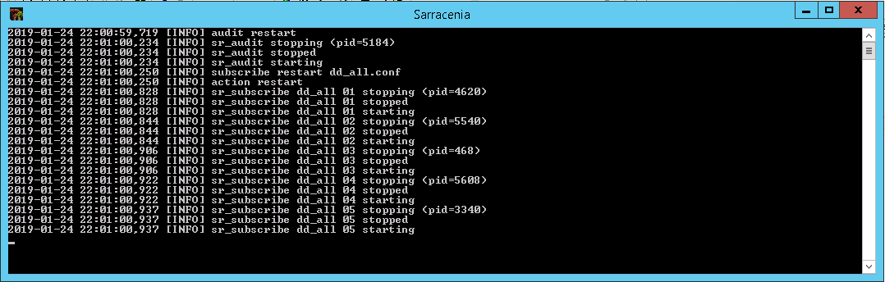
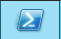
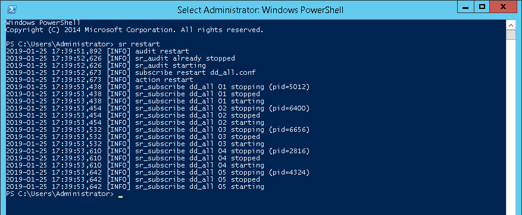
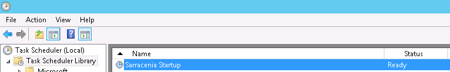

===================
Windows user manual
===================

.. no section-numbering::

This document teaches a novice user with Python on Windows how to run/install Sarracenia in various way. 
The screenshots were taken from Windows Server 2012. Feel free to create issues if you believe that this
document could be enhanced with one (or more) important case(s).

Running Sarracenia with a Command Prompt
----------------------------------------
From the Start Menu:
~~~~~~~~~~~~~~~~~~~~
Click on Sarracenia (it will execute *sr.exe restart*):

This will pop Sarracenia's Command Prompt, start Sarracenia processes as instructed by your configurations and show logging information.

Keep this window alive until you are done with Sarracenia. Closing it or typing ctrl-c will kill all Sarracenia processes. You may also want to restart Sarracenia which will stop those processes cleanly.

From a Windows Powershell session:
~~~~~~~~~~~~~~~~~~~~~~~~~~~~~~~~~~
Launch a Powershell |powershell| session and type this command at the prompt::

 sr restart

This will start Sarracenia processes as instructed by your configurations and show logging information

Keep this Powershell session alive until you are done with Sarracenia. To stop Sarracenia you may type::

 sr stop

This will stop all Sarracenia processes cleanly as would do a restart. Closing this window will also kill all processes.

From Anaconda:
~~~~~~~~~~~~~~
Run this command::

 activate sarracenia && sr restart

Running Sarracenia without a Command Prompt
-------------------------------------------
Here is a case where someone (like a sysadmin) needs to run Sarracenia without a Command Prompt and ensure that the system starts at Windows startup. The obvious way of doing it would be from the Task Scheduler.

From the Task Scheduler:
~~~~~~~~~~~~~~~~~~~~~~~~
Open Server Manager > Tools > Task scheduler:

.. image:: task-scheduler_start.png

Select *Create Basic Task* from the action panel:

.. image:: create-basic-task.png

This will launch the *Create Basic Task Wizard* where you first 

 Fill the name:

 .. image:: cbtw_name.png

 Choose the trigger:

 .. image:: cbtw_trigger.png

 Choose the action:
 
 .. image:: cbtw_action.png
 
 Define the action:
 
 .. image:: cbtw_action_program.png
 
 Review the task and open the *Properties dialog*:
 
 .. image:: cbtw_finish.png
 
 Choose *Run whether user is logged on or not* and *Run with highest privileges*:
 
 .. image:: ssp_general.png

The task should now appear in your *Task Scheduler Library* with the status *Ready*. You may run it immediately with the |run_action| button.

Installation Instructions:
--------------------------

Install MetPX-Sarracenia
~~~~~~~~~~~~~~~~~~~~~~~~

#. Download **Windows installer** and execute it (click next all the way)
#. Add Sarracenia's Python directory to your **PATH**

Install MetPX-Sarracenia with Python.org
~~~~~~~~~~~~~~~~~~~~~~~~~~~~~~~~~~~~~~~~

#. Download and install python.org (latest):

    Take care of including python in PATH variable (checkbox)

#. Install paramiko and MetPX-Sarracenia:

    In Powershell (run as Administrator)::

     pip install paramiko
     pip install metpx-sarracenia

Install MetPX-Sarracenia with Anaconda prompt
~~~~~~~~~~~~~~~~~~~~~~~~~~~~~~~~~~~~~~~~~~~~~

#. Install MetPX-Sarracenia and its dependencies all in once with this command:

    In Anaconda Prompt (run as Administrator)::

     conda env create -f environment.yml

