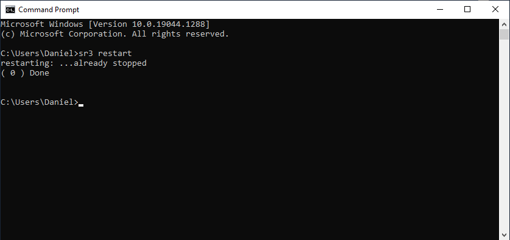
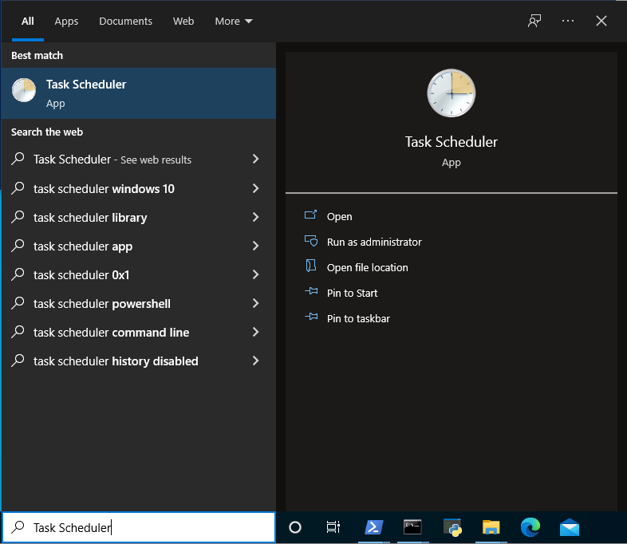
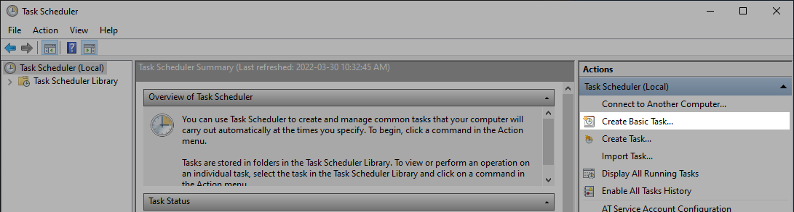

===================
Windows user manual
===================

.. no section-numbering::

This document teaches novice user with Python on Windows how they could easily run Sarracenia in various ways. 
The screenshots were taken from *Windows Server 2012 R2 Standard* edition. Feel free to create issues if 
you believe that this document could be enhanced with one (or more) important case(s).

Running Sarracenia with a Command Prompt
----------------------------------------

From the Start Menu:
~~~~~~~~~~~~~~~~~~~~
Click on Sarracenia (it will execute *sr3.exe restart*):

.. image:: Windows/start-menu-1.png

This will pop Sarracenia's Command Prompt, start Sarracenia processes as instructed by your configurations and show logging information.

Keep this window alive until you are done with Sarracenia. Closing it or typing ctrl-c will kill all Sarracenia processes. You may also want to restart Sarracenia which will stop those processes cleanly.

From a Windows Powershell session:
~~~~~~~~~~~~~~~~~~~~~~~~~~~~~~~~~~
Launch a Powershell |powershell| session and type this command at the prompt::

 sr3 restart

.. |powershell| image:: Windows/powershell.png

This will start Sarracenia processes as instructed by your configurations and show logging information

.. image:: Windows/02_prompt_powershell.png 

Keep this Powershell session alive until you are done with Sarracenia. To stop Sarracenia you may type::

 sr3 stop

This will stop all Sarracenia processes cleanly as would do a restart. Closing this window will also kill all processes.

From Anaconda Prompt:
~~~~~~~~~~~~~~~~~~~~~
Run this command::

 activate sr3 && s3r restart

Running Sarracenia without a Command Prompt
-------------------------------------------
Here is a case where someone (like a sysadmin) needs to run Sarracenia without a Command Prompt and ensure that the system starts at Windows startup.
The obvious way of doing it would be from the Task Scheduler.

From the Task Scheduler:
~~~~~~~~~~~~~~~~~~~~~~~~
Open Task scheduler:

Select *Create Basic Task...* from the action panel on the right:

This will launch the *Create Basic Task Wizard* where you ...

 Fill the name:

 .. image:: Windows/05_fill_the_name.png

 Choose the trigger:

 .. image:: Windows/06_choose_trigger.png

 Choose the action:
 
 .. image:: Windows/07_choose_action.png
 
 Define the action:
 
 .. image:: Windows/08_define_action.png
 
 Review the task and choose *Finish*:
 
 .. image:: Windows/09_finish.png
 
Open the *Properties dialog* and choose *Run whether user is logged on or not* and *Run with highest privileges*:
 
.. image:: Windows/10_properties_dialog.png

The task should now appear in your *Task Scheduler Library* with the status *Ready*.

.. image:: Windows/12_task_scheduler_ready.png

Then, you may run it immediately with the |run_action| button.

.. |run_action| image:: Windows/run_action.png
