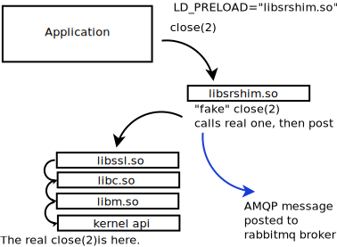

==================================
 Étude de cas : Mise en miroir HPC
==================================

----------------------------------------------------------------------------------
 Mise en miroir continue de 27 millions d’arborescence de fichiers très rapidement
----------------------------------------------------------------------------------

Résumé
------
Ce projet a pris plus de temps que prévu, soit plus de trois ans, car l’espace problématique a été exploré avec le
l’aide d’un client très patient alors que l’outil pour concevoir et mettre en œuvre la solution efficace était finalement
réglé. Le client a demandé une solution pour rendre les fichiers disponibles sur le cluster de sauvegarde dans
un délai de cinq minutes de leur création sur la principale, et la première version de mirroring, déployée en 2017,
atteint un délai d’environ 20 minutes.  La version 2 a été déployée en janvier 2020.

Le client est en fait plus un partenaire, qui avait de très gros cas de test disponibles et
a fini par assumer la responsabilité pour nous tous de comprendre si la solution fonctionnait ou non.
Bien qu’il existe de nombreuses spécificités de cette implémentation, l’outil résultant ne repose sur aucune
fonctionnalité spécifique au-delà d’un système de fichiers Linux normal pour atteindre une accélération de
72:1 par rapport à rsync en temps réel en mise en miroir continu de 16 téraoctets dans 1,9 million de fichiers
par jour entre deux arbres de 27 millions de fichiers chacun. Pendant que cela atteint en moyenne 185 Mo/seconde
sur une période de 24 heures. Il convient de noter que les transferts sont très pointus. Sur le même équipement
en même temps, un autre 4 téraoctets par jour sont écrits sur des clusters sur un autre réseau, de sorte que
le taux de lecture agrégé sur le cluster opérationnel est de 20 téraoctets par jour (231 Mo/seconde)
pour cette application, tandis que les systèmes de fichiers sont également utilisés pour toutes les
applications d'utilisateur normales.

Alors que ce projet a dû souffrir à travers le développement, avec les leçons apprises et les outils
maintenant disponible, il devrait être simple d’appliquer cette solution à d’autres cas. Le résultat final est
que l’on ajoute une `Shim Library`_ à l’environnement des utilisateurs (transparent pour les tâches des utilisateurs), et
puis chaque fois qu’un fichier est écrit, un message AMQP avec les métadonnées du fichier est publié. Un pool de
démons de transfert sont prêts à transférer les fichiers publiés dans une file d’attente partagée. Le nombre d’abonnés
est programmable et évolutif, et les techniques et la topologie pour effectuer le transfert sont toutes facilement
contrôlé pour optimiser les transferts pour les critères jugés les plus importants.

Énoncé du problème
------------------

En novembre 2016, le Service météorologique du Canada (MSC) d’Environnement et Changement climatique Canada (ECCC)
dans le cadre du projet High Performance Computing Replacement (HPCR) a demandé un très grand répertoire
d'arbres à refléter en temps réel. Services partagés Canada (SPC) était le principal responsable du déploiement
du HPCR, ECCC/MSC étant la seule communauté d’utilisateurs. On savait dès le départ que ces arbres seraient trop grands pour
traiter l’utilisation d’outils ordinaires. On s’attendait à ce qu’il faille environ 15 mois pour explorer
et arriver à un déploiement opérationnel efficace. Il convient de noter que SPC a travaillé tout au long de
cette période en partenariat étroit avec ECCC, et que ce déploiement a nécessité la participation très active
d'utilisateurs sophistiqués à suivre avec les rebondissements et les différentes avenues explorées et mises en œuvre.

L’environnement informatique est le centre météorologique national du Canada, dont l’application principale est
la *production* numérique de la prévision météorologique, où les modèles fonctionnent 7j/7 et 24h/24
en exécutant différentes simulations (modèles de l’atmosphère, et parfois les voies navigables et l’océan,
et la terre sous l’atmosphère) soit en ingérant les observations actuelles aka *assimilation*, les mapper
à une grille *analyse*, puis faire avancer la grille dans le temps *prédiction/pronostic*. Les prévisions
suivent un calendrier précis tout au long du cycle de 24 heures, alimentant l’un dans l’autre, de sorte
que les retards se répercutent et que des efforts considérables sont déployés pour éviter les interruptions et
maintiennent l’horaire.

Présentation de la solution HPCR
--------------------------------
.. image:: ../../../Explanation/History/HPC_Mirroring_Use_Case/HPC-XC_High_Availability.png
   :scale: 66 %

Dans le diagramme ci-dessus, si les opérations se trouvent dans le hall de données 1 (à gauche du centre)
et qu’elles échouent, l’objectif est de reprendre les opérations rapidement à partir du Data Hall 2
(à droite). Pour que cela soit réaliste, les données de production doivent être disponibles
dans l’autre hall, sur l’autre boutique du site, rapidement. Le problème de la *mise en miroir* est la
synchronisation d’un très grand sous-ensemble de données entre le boutique de sites 1 et le magasin de
sites 2. À des fins de surveillance, dans le même temps, un sous-ensemble doit être mis en miroir
dans la salle de données 0.

Mise en miroir continue
-----------------------

Il y a deux clusters qui exécutent ces simulations, l’un d’eux travaillant normalement principalement
sur les opérations, et l’autre en tant que *rechange* (exécutant uniquement des charges de recherche
et développement).  Lorsque la primaire échoue, l’intention est d’exécuter des opérations sur l’autre
supercalculateur, en utilisant un disque *de rechange* sur lequel toutes les données en direct ont été
mises en miroir. Comme il y a (presque) toujours des exécutions en cours, les répertoires n’ont jamais
arrêté d’être modifié, et il n’y a pas de période de maintenance où l’on peut rattraper si l’on prend
du retard.

Il y a essentiellement trois parties du problème :

 * Détection : obtenir la liste des fichiers qui ont été modifiés (récemment).
 * Transfert: copiez-les sur l’autre cluster (minimisant la surcharge.)
 * Performance : délai ambitieux pour livrer un fichier miroir : cinq minutes.

Les arbres réels à refléter étaient les suivants dans la phase contractuelle initiale (appelée rétrospectivement U0)::

     psilva@eccc1-ppp1:/home/sarr111/.config/sarra/poll$ grep directory *hall1*.conf
     policy_hall1_admin.conf:directory /fs/site1/ops/eccc/cmod/prod/admin
     policy_hall1_archive_dbase.conf:directory /fs/site1/ops/eccc/cmod/prod/archive.dbase
     policy_hall1_cmop.conf:directory /fs/site1/ops/eccc/cmod/cmop/data/maestro/smco500
     policy_hall1_daily_scores.conf:directory /fs/site1/ops/eccc/cmod/prod/daily_scores
     policy_hall1_hubs.conf:directory /fs/site1/ops/eccc/cmod/prod/hubs
     policy_hall1_products.conf:directory /fs/site1/ops/eccc/cmod/prod/products
     policy_hall1_stats.conf:directory /fs/site1/ops/eccc/cmod/prod/stats
     policy_hall1_version_control.conf:directory /fs/site1/ops/eccc/cmod/prod/version_control
     policy_hall1_work_ops.conf:directory /fs/site1/ops/eccc/cmod/prod/work_ops
     policy_hall1_work_par.conf:directory /fs/site1/ops/eccc/cmod/prod/work_par
     psilva@eccc1-ppp1:/home/sarr111/.config/sarra/poll$
 
Au départ, on savait que le nombre de dossiers était important, mais on ne connaissait pas
les montants en jeu. Ces données n'ont seulement été disponibles que beaucoup plus tard.

La façon la plus efficace de copier ces arbres, comme on l’a dit au début, serait pour tous les travaux
d'écrire des fichiers dans les arborescences pour annoncer explicitement les fichiers à copier. Cela
impliquerait aux utilisateurs de modifier leurs tâches pour inclure l’appel de sr_cpost (une commande qui
met en file d’attente les transferts de fichiers pour que les tiers les exécutent). Toutefois, le client
a défini la contrainte supplémentaire selon laquelle la modification des tâches d'utilisateur
n’était pas réalisable, la méthode utilisée pour obtenir la liste des fichiers à copier devait être
implicite (effectuée sans la participation active de l’utilisateur).

La lecture de l’arbre prend trop de temps
-----------------------------------------
On pourrait simplement analyser à un niveau supérieur afin d’analyser un seul répertoire parent, mais la demi-douzaine
des sous-arbres des arbres ont été choisis afin d’en avoir des plus petits qui fonctionnaient plus rapidement,
indépendamment de la méthode utilisée pour obtenir des listes de nouveaux fichiers. Que voulons-nous dire quand
nous disons que ces arbres sont trop grands? Le plus grand de ces arbres est *hubs*
( /fs/site1/ops/eccc/cmod/prod/hubs ). Rsync a été exécuté sur les *hubs*, en tant que juste visiter l’arbre une fois,
sans aucune copie de fichier en cours. Visiter l’arbre, en utilisant rsync avec la somme de contrôle
désactivée en tant qu’optimisation, a abouti au journal ci-dessous::

 psilva@eccc1-ppp1:~/test$ more tt_walk_hubs.log
 nohup: ignoring input
 rsync starting @ Sat Oct  7 14:56:52 GMT 2017
 number of files examined is on the order of: rsync --dry-run --links -avi --size-only /fs/site1/ops/eccc/cmod/prod/hubs /fs/site2/ops/eccc/cmod/prod/hubs |& wc -l
 27182247
 rsync end @ Sat Oct  7 20:06:31 GMT 2017
 psilva@eccc1-ppp1:~/test$
 
Un **seul passage a pris plus de cinq heures pour examiner 27 millions de dossiers ou** examiner
**environ 1500 fichiers par seconde**. Le taux maximal d’exécution de rsyncs sur cet arbre est
donc de l’ordre d’une fois toutes les six heures (pour permettre un certain temps de copie) pour
cet arbre. Notez que toute méthode habituelle de copie d’une arborescence de répertoires nécessite
de parcourir et qu’il n’y a aucune raison de croire qu’un autre outil tel que find, dump, tar, tree,
etc... serait nettement plus rapide que rsync. Nous avons besoin d’une méthode plus rapide pour savoir
quels fichiers ont été modifiés afin qu’ils puissent être copiés.

Méthodes de détection : Inotify, Policy, SHIM
---------------------------------------------

Il existe une fonctionnalité du noyau Linux appelée INOTIFY, qui peut déclencher un événement
lorsqu’un fichier est modifié. En définissant un déclencheur INOTIFY sur chaque répertoire de
l’arborescence, nous pouvons être avertis lorsqu’un fichier est modifié dans l’arbre. C’était
l’approche initiale adoptée. Il s’avère (en janvier 2017), qu’INOTIFY est bien une fonctionnalité
Linux, en ce sens que les événements INOTIFY ne se propagent que sur un seul serveur. Avec un
système de fichier cluster comme GPFS, il faut exécuter un moniteur INOTIFY sur chaque noyau
où les fichiers sont écrits. Donc, plutôt que d’exécuter un seul démon, nous étions confrontés
à l’exécution de plusieurs centaines de démons (un par nœud physique), chacun surveillant le
même ensemble de dizaines de millions de fichiers. Puisque les démons fonctionnaient sur de
nombreux nœuds, l’utilisation de la mémoire a atteint le téraoctet.

Une autre approche : au lieu d’exécuter la détection de modification au niveau Linux, utilisez
le système de fichier lui-même, qui est piloté par une base de données, pour indiquer quels
fichiers ont été modifiés. Les principaux objectifs de la solution HPC et le système de stockage qui
utilise le système de fichiers parallèle général d’IBM, ou GPFS. À l’aide de la méthode *GPFS-policy*,
une requête est exécutée sur la base de données du système de fichiers à un rythme aussi élevé que
possible (environ cinq à dix minutes par requête) combiné avec sr_poll pour annoncer les fichiers
modifiés (et donc éligibles à la copie). C’est complètement non portable, mais on s’attendait à
ce qu’il soit beaucoup plus rapide que la traversée de l’arborescence des fichiers.

Au cours de l’hiver 2016-2017, ces deux méthodes ont été mises en œuvre. Le sr_watch basé sur
INOTIFY était la méthode la plus rapide (instantanée), mais les démons avaient des problèmes de
stabilité et de consommation de mémoire, et ils ont également pris trop de temps à démarrer
(nécessite une traversée initiale de l’arbre, qui prend le même temps que rsync). Bien que plus
lent (prenant plus de temps pour remarquer qu’un fichier a été modifié), la politique GPFS avait
une performance *acceptable* et était beaucoup plus fiable que la méthode de sr_watch parallèle,
et au printemps, avec un déploiement prévu pour le début de juillet 2017, l’approche stratégique
du GPFS a été choisie.

Au fur et à mesure que la migration progressait, les systèmes de fichiers se développaient parce
qu'ils avaient plus de fichiers dans les arborescences et la méthode de stratégie GPFS a
progressivement ralentie. Déjà en juillet 2017, ce n’était pas une solution acceptable. À ce stade,
l’idée d’intercepter les appels d’i/o de fichiers de jobs avec une bibliothèque SHIM a été introduite.
ECCC a dit à SPC à l’époque, le fait d’avoir une alimentation correcte et d’avoir tout prêt pour la
transition était la priorité, de sorte que les efforts se sont concentrés dans cette direction jusqu’à
ce que la migration soit réalisée en septembre. Bien qu’il s’agisse d’une priorité moindre au cours de
l’été, une mise en œuvre C de la partie d’envoi de la bibliothèque Sarra a été implémentée avec un
prototype de bibliothèque Shim pour l’appeler.

C'est à noter que les exécutions de la politique GPFS ont été déployées opérationnellement depuis 2017.
Cela s’est avéré être la *version 1* de la solution de mise en miroir, et a permis d’obtenir une mise
en miroir vers les clusters secondaires avec environ 20 minutes de retard pour acheminer les données vers
le deuxième système. Trois ans plus tard, il y a maintenant une mise à niveau des clusters de
supercalculateurs (appelée U1) en cours avec deux nouveaux clusters supplémentaires en ligne.
Le client utilise maintenant les méthodes normales Sarracenia pour mettre en miroir l’ancien cluster
de sauvegarde vers les nouveaux, avec seulement quelques secondes de retard au-delà de ce qu’il faut pour
accéder au cluster de sauvegarde.

Il convient également de noter que l’utilisation de requêtes de stratégie GPFS a imposé une charge
importante, et continue, aux clusters GPFS, et constitue une préoccupation constante pour les
administrateurs GPFS. Ils aimeraient beaucoup s’en débarrasser. Les performances se sont stabilisées
au cours de la dernière année, mais elles semblent ralentir à mesure que la taille de l’arborescence
des fichiers augmente. De nombreuses optimisations ont été mises en œuvre pour obtenir des performance
adéquates.

Bibliothèque Shim
~~~~~~~~~~~~~~~~~

La méthode choisie pour la notification est une `bibliothèque Shim <https://en.wikipedia.org/wiki/Shim_(computing)>`_
Lorsqu’une application en cours d’exécution effectue des appels aux points d’entrée d’API
fournis par les bibliothèques ou le noyau, il existe un processus de recherche (résolu au
moment du chargement de l’application) qui trouve la première entrée dans le chemin d’accès
qui a la signature appropriée. Par exemple, lors de l’émission d’un appel de fermeture de
fichier(2), le système d’exploitation organisera l’appel de la routine correcte dans la
bibliothèque appropriée.

.. image:: ../../../Explanation/History/HPC_Mirroring_Use_Case/shim_explanation_normal_close.svg

Un appel à la routine de fermeture indique qu’un programme a fini d’écrire le fichier en question,
et indique donc généralement la première fois qu’il est utile d’annoncer un fichier pour le transfert.
Nous avons créé une bibliothèque Shim, qui a des points d’entrée qui usurpent l’identité de ceux
appelés par l’application, afin que les notifications de disponibilité des fichiers soient publiées
par l’application elle-même, sans aucune modification de l’application.

L’utilisation de la bibliothèque de Shim est détaillée dans `sr_post(1) <../Reference/sr3.1.html#post>`_

Copie de fichiers
-----------------

Il est important de noter que pendant que tout ce travail progressait sur la partie "obtenir
la liste des fichiers à copier" du problème, nous travaillions également sur la partie "copier
les fichiers de l’autre côté" du problème. Au cours de l’été, les résultats des tests de
performance et d’autres considérations ont entraîné de fréquents changements de tactique.
Les *boutique du sites* sont des clusters à part entière.  Ils ont des nœuds de protocole pour
servir le trafic en dehors du cluster GPFS. Il existe des nœuds siteio avec des connexions
infiniband et des disques réels. Les nœuds de protocole (appelés nfs ou proto) sont des
participants du cluster GPFS dédié aux opérations d’i/o, utilisé pour décharger les i/o du
clusters de calcul principaux (PPP et Supercalculateur), qui ont des connexions comparables
au boutique du sites en tant que nœuds de protocole.

Il existe plusieurs réseaux (40GigE, Infiniband, ainsi que des réseaux de gestion) et celui
à utiliser doit également être choisi.  Ensuite, il y a les méthodes de communication (ssh
sur tcp / ip? BBCP sur TCP/IP ? GPFS sur tcpip? Ipoib? natif-ib?).

.. image:: ../../Explanation/History/HPC_Mirroring_Use_Case/site-store.jpg

De nombreuses sources et destinations différentes (ppp, nfs et nœuds de protocole), ainsi que
de nombreuses méthodes différentes (rcp, scp, bbcp, sscp, cp, dd) ont toutes été testées à des
degrés différents à différents moments. À ce stade, plusieurs forces de sarracenia étaient évidentes:

* La séparation de la publication et de l’abonnement signifie que l’on peut s’abonner sur le
  nœud source et pousser vers la destination, ou sur la destination et extraire de la source.
  Il est facile à adapter à l’une ou l’autre approche (on s’est retrouvé avec les nœuds de
  protocole de destination, en tirant de la source).

* La séparation de copier depuis des jobs computationnel signifie que les temps d’exécution des
  modèles ne sont pas affectés, car les travaux d’i/o sont complètement séparés.

* La capacité d’adapter le nombre de travailleurs à la performance requise (finalement décidé
  de 40 travailleurs effectuant des copies en parallèle).

* La disponibilité des plugins *download_cp*, *download_rcp*, *download_dd*, permet d’appliquer
  facilement de nombreux programmes de copie différents (et donc des protocoles) au problème de transfert.

De nombreux critères différents ont été pris en compte (tels que: charge sur les nœuds nfs/protocole,
autres nœuds, vitesse de transfert, charge sur les nœuds PPP). La configuration finale sélectionnée
d’utiliser *cp* (via le *download_cp* plugin) initié à partir des nœuds de protocole de la
boutique du site récepteur.  Ainsi, les lectures se produiraient via GPFS sur IPoIB, et les
écritures seraient effectuées sur GPFS natif sur IB. Ce n’était pas la méthode de transfert la
plus rapide testée (*bbcp* était plus rapide), mais elle a été sélectionnée parce qu’elle
répartissait la charge sur les nœuds siteio, ce qui entraînait un NFS et un protocole plus stable.
Les nœuds et surcharge de configuration TCP/IP/démontage supprimée. La partie "copier les fichiers
de l’autre côté" du problème était stable à la fin de l’été 2017, et l’impact sur la stabilité
du système est minimisé.

Bibliothèque Shim nécessaire
----------------------------

Malheureusement, la mise en miroir entre les sites fonctionnait avec un décalage d’environ 10 minutes
sur le système de fichiers source (environ 30 fois plus rapide qu’une approche rsync naïve), et ne
fonctionnait qu’en principe, avec de nombreux fichiers manquants dans la pratique, elle n’était pas
utilisable aux fins prévues. La mise en service opérationnelle de la solution HPCR dans son ensemble
(avec mise en miroir différée) a eu lieu en septembre 2017, et les travaux de mise en miroir ont
essentiellement été arrêtés jusqu’en octobre (en raison des activités liées aux travaux de mise en
service).

Nous avons continué à travailler sur deux approches, la libsrshim et la politique GPFS. Les requêtes
exécutées par la politique GPFS devaient être réglées, éventuellement un chevauchement de 75 secondes
(où une requête suivante demandait des modifications de fichier jusqu’à un point 75 secondes avant la
fin de la dernière) car il y avait des problèmes avec les fichiers manquants dans les copies. Même avec
ce niveau de chevauchement, il manquait encore des dossiers. À ce stade, fin novembre, début décembre,
les libsrshim fonctionnaient assez bien pour être si encourageants que les gens ont perdu tout intérêt
pour la politique du GPFS. Contrairement à un délai moyen d’environ 10 minutes pour démarrer une copie
de fichier avec des requêtes de stratégie GPFS, l’approche libsrshim a la copie en file d’attente dès
que le fichier est fermé sur le système de fichiers source.

Il convient de noter que lorsque le travail a commencé, l’implémentation python de Sarracenia était
un outil de distribution de données, sans support pour la mise en miroir. Au fur et à mesure que
l’année avançait, des fonctionnalités (prise en charge des liens symboliques, transport des attributs
de fichier, prise en charge de la suppression de fichiers) ont été ajoutées au package initial. L’idée
d’un traitement périodique (appelé pulsations) a été ajoutée, d’abord pour détecter les défaillances
des clients (en voyant les journaux inactifs), mais plus tard pour lancer le nettoyage de la mémoire
pour la cache des doublons, la surveillance de l’utilisation de la mémoire et la récupération d’erreurs
complexes. Le cas d’utilisation a précipité de nombreuses améliorations dans l’application, y compris
une deuxième implémentation en C pour les environnements où un environnement Python3 était difficile
à établir, ou où l’efficacité était primordiale (le cas libsrshim).

Est-ce que ça marche?
---------------------

En décembre 2017, le logiciel pour l’approche libsrshim semblait prêt, il a été déployé en quelques
petites exécutions parallèles (non opérationnelles). Les essais en parallèle ont commencé en janvier 2018.
Il y a eu de nombreux cas limites, et les tests se sont poursuivis pendant deux ans, jusqu’à ce qu’ils
soient finalement prêts à être déployés en décembre 2019.

* **FIXME:** inclure des liens vers des plugins

* **FIXME:** Une autre approche envisagée consiste à comparer les instantanés du système de fichiers.

Comme la bibliothèque Shim a été utilisée dans des contextes de plus en plus larges pour la rapprocher
du déploiement, un nombre important de cas limites ont été rencontrés :

* Utilisation avec des shells non-login (en particulier SCP) ( https://github.com/MetPX/sarrac/issues/66  )

* Les applications Fortran boguées appellent de manière incorrecte la fermeture  ( https://github.com/MetPX/sarrac/issues/12  )

* TCL/TK traitant toute sortie vers STDERR comme une défaillance ( https://github.com/MetPX/sarracenia/issues/69 )

* *scripts shell hautes performances* (  https://github.com/MetPX/sarrac/issues/15 )

* Code qui ne ferme pas tous les fichiers ( https://github.com/MetPX/sarrac/issues/11 )

* code qui ne ferme pas un seul fichier ( https://github.com/MetPX/sarrac/issues/68 )

* Il y a des chemins utilisés de plus de 255 caractères ( https://github.com/MetPX/sarrac/issues/39 )

* Affrontements dans les symboles, provoquant le crash de SED ( https://github.com/MetPX/sarrac/issues/80 )

Au cours des deux années qui ont suivi, ces cas limites ont été traités et le déploiement a
finalement eu lieu avec la transition vers U1 en janvier 2020. On s’attend à ce que le délai
dans les fichiers apparaissant sur le deuxième système de fichiers soit de l’ordre de cinq
minutes après leur écriture dans l’arborescence source, soit 72 fois plus rapide que rsync
(voir la section suivante pour les informations sur les performances), mais nous n’avons pas
encore de métriques concrètes.

La question s’est naturellement posée, si l’arborescence des répertoires ne peut pas être
parcourue, comment savons-nous que les arborescences source et destination sont les mêmes ?
Un programme permettant de sélectionner des fichiers aléatoires sur l’arborescence source
est utilisé pour alimenter un sr_poll, qui ajuste ensuite le chemin pour le comparer au
même fichier sur la destination. Sur un grand nombre d’échantillons, nous obtenons une
quantification de la précision de la copie. Le plugin pour cette comparaison est encore
en développement.

Est-ce rapide?
--------------

Les exécutions de la politique GPFS sont toujours la méthode utilisée sur le plan opérationnel au moment
de la rédaction de cet article (2018/01). Les chiffres de performances indiqués dans le résumé sont extraits
des journaux d’une journée d’exécution de stratégie GPFS.

 * Hall1 à Hall2: bytes/days: 18615163646615 = 16T, nb fichier/jour:  1901463
 * Hall2 à CMC: octets/jours: 4421909953006 = 4T, nb fichier/jour: 475085

Tout indique que la bibliothèque de shim copie plus de données plus rapidement que les exécutions
basées sur des stratégies, mais jusqu’à présent (2018/01), seuls des sous-ensembles de l’arborescence
principale ont été testés.  Sur une arborescence de 142000 fichiers, l’exécution de la stratégie GPFS
avait un temps de transfert moyen de 1355 secondes (environ 23 minutes), alors que l’approche de la
bibliothèque de shim avait un temps de transfert moyen de 239 secondes (moins de cinq minutes) ou une
accélération pour libshim vs stratégie GPFS d’environ 4:1. Sur un deuxième arbre où la bibliothèque
de Shim transférait 144 000 fichiers en une journée, le temps de transfert moyen était de 264 secondes,
alors que le même arbre avec l’approche de politique GPFS prenait 1175 (essentiellement 20 minutes).

Les statistiques sont accumulées pour des heures particulières, et à des heures de faible trafic, le
temps de transfert moyen avec la bibliothèque de Shim était de 0,5 seconde contre 166 secondes avec la
politique. On pourrait prétendre à une accélération de 300:1, mais cela est inhérent au fait que la
méthode GPFS-policy doit être limitée à une certaine intervalle d’interrogation (cinq minutes) pour
limiter l’impact sur le système de fichiers, et cela fournit une limite inférieure sur la latence
de transfert.

Sur des arbres comparables, le nombre de fichiers copiés avec la bibliothèque shim est toujours plus
élevé qu’avec la stratégie GPFS. Bien que l’exactitude soit encore en cours d’évaluation, la méthode
shim fonctionne apparemment mieux que la politique. Si nous revenons à la performance rsync d’origine
de 6 heures pour l’arbre, alors le ratio que nous prévoyons de livrer est de 6 heures contre 5 minutes ...
ou une accélération de 72:1.

Ce qui précède est basé sur le rapport client suivant :

.. code:: bash
 
    Jan 4th
    Preload:
    dracette@eccc1-ppp1:~$ ./mirror.audit_filtered -c ~opruns/.config/sarra/subscribe/ldpreload.conf  -t daily -d 2018-01-04
    Mean transfer time: 238.622s
    Max transfer time: 1176.83s for file: /space/hall2/sitestore/eccc/cmod/cmoi/opruns/ldpreload_test/hubs/suites/par/wcps_20170501/wh/banco/cutoff/2018010406_078_prog_gls_rel.tb0
    Min transfer time: 0.0244577s for file: /space/hall2/sitestore/eccc/cmod/cmoi/opruns/ldpreload_test/hubs/suites/par/capa25km_20170619/gridpt/qperad/radar/radprm/backup/ATX_radprm
    Total files: 142426
    Files over 300s: 44506
    Files over 600s: 14666
    Policy:
    dracette@eccc1-ppp1:~$ ./mirror.audit_filtered -c ~opruns/.config/sarra/subscribe/mirror-ss1-from-hall2.conf  -t daily -d 2018-01-04
    Mean transfer time: 1355.42s
    Max transfer time: 2943.53s for file: /space/hall2/sitestore/eccc/cmod/prod/hubs/suites/par/capa25km_20170619/gridpt/qperad/surface/201801041500_tt.obs
    Min transfer time: 1.93106s for file: /space/hall2/sitestore/eccc/cmod/prod/archive.dbase/dayfiles/par/2018010416_opruns_capa25km_rdpa_final
    Total files: 98296
    Files over 300s: 97504
    Files over 600s: 96136
     
    Jan 3rd
    Preload:
    dracette@eccc1-ppp1:~$ ./mirror.audit_filtered -c ~opruns/.config/sarra/subscribe/ldpreload.conf  -t daily -d 2018-01-03
    Mean transfer time: 264.377s
    Max transfer time: 1498.73s for file: /space/hall2/sitestore/eccc/cmod/cmoi/opruns/ldpreload_test/hubs/suites/par/capa25km_20170619/gridpt/capa/bassin/6h/prelim/05/2018010312_05ME005_1.dbf
    Min transfer time: 0.0178287s for file: /space/hall2/sitestore/eccc/cmod/cmoi/opruns/ldpreload_test/hubs/suites/par/capa25km_20170619/gridpt/qperad/radar/statqpe/backup/XSS_0p1_statqpe
    Total files: 144419
    Files over 300s: 60977
    Files over 600s: 14185
    Policy:
    dracette@eccc1-ppp1:~$ ./mirror.audit_filtered -c ~opruns/.config/sarra/subscribe/mirror-ss1-from-hall2.conf  -t daily -d 2018-01-03
    Mean transfer time: 1175.33s
    Max transfer time: 2954.57s for file: /space/hall2/sitestore/eccc/cmod/prod/hubs/suites/par/capa25km_20170619/gridpt/qperad/surface/201801032200_tt.obs
    Min transfer time: -0.359947s for file: /space/hall2/sitestore/eccc/cmod/prod/hubs/suites/par/capa25km_20170619/gridpt/qperad/radar/pa/1h/XTI/201801031300~~PA,PA_PRECIPET,EE,1H:URP:XTI:RADAR:META:COR1
    Total files: 106892
    Files over 300s: 106176
    Files over 600s: 104755
     
    À garder à l’esprit:
     
    Nous avons 12 instances pour le préchargement alors que nous en exécutons 40 pour la stratégie.

    * J’ai filtré l’ensemble des fichiers qui faussaient fortement les résultats.
    * L’audit de préchargement en tranches horaires montre qu’il est fortement lié à l’instance.
    * Si nous devions l’augmenter, il devrait donner de bien meilleurs résultats dans des situations de compte élevé.

    Voici à nouveau le 4 janvier, mais par tranche horaire:

    dracette@eccc1-ppp1:~$ ./mirror.audit_filtered -c ~opruns/.config/sarra/subscribe/ldpreload.conf  -t hourly -d 2018-01-04
    00 GMT
    Mean transfer time: 0.505439s
    Max transfer time: 5.54261s for file: /space/hall2/sitestore/eccc/cmod/cmoi/opruns/ldpreload_test/hubs/suites/par/capa25km_20170619/gridpt/qperad/radar/pa/6h/XME/201801040000~~PA,PA_PRECIPET,EE,6H:URP:XME:RADAR:META:NRML
    Min transfer time: 0.0328007s for file: /space/hall2/sitestore/eccc/cmod/cmoi/opruns/ldpreload_test/hubs/suites/par/capa25km_20170619/gridpt/qperad/radar/statqpe/backup/IWX_0p5_statqpe
    Total files: 847
    Files over 300s: 0
    Files over 600s: 0
    01 GMT
    Mean transfer time: 166.883s
    Max transfer time: 1168.64s for file: /space/hall2/sitestore/eccc/cmod/cmoi/opruns/ldpreload_test/hubs/suites/par/wcps_20170501/wh/banco/cutoff/2018010318_078_prog_gls_rel.tb0
    Min transfer time: 0.025425s for file: /space/hall2/sitestore/eccc/cmod/cmoi/opruns/ldpreload_test/hubs/suites/par/capa25km_20170619/gridpt/qperad/biais/6h/XPG/201801031800_XPG_statomr
    Total files: 24102
    Files over 300s: 3064
    Files over 600s: 1
    02 GMT
    Mean transfer time: 0.531483s
    Max transfer time: 4.73308s for file: /space/hall2/sitestore/eccc/cmod/cmoi/opruns/ldpreload_test/archive.dbase/dayfiles/par/2018010401_opruns_capa25km_rdpa_preli
    Min transfer time: 0.0390887s for file: /space/hall2/sitestore/eccc/cmod/cmoi/opruns/ldpreload_test/hubs/suites/par/capa25km_20170619/gridpt/qperad/radar/radprm/XMB/201801031900_XMB_radprm
    Total files: 774
    Files over 300s: 0
    Files over 600s: 0
    03 GMT
    Mean transfer time: 0.669443s
    Max transfer time: 131.666s for file: /space/hall2/sitestore/eccc/cmod/cmoi/opruns/ldpreload_test/hubs/suites/par/capa25km_20170619/gridpt/qperad/radar/pa/1h/WKR/201801032000~~PA,PA_PRECIPET,EE,1H:URP:WKR:RADAR:META:COR2
    Min transfer time: 0.0244577s for file: /space/hall2/sitestore/eccc/cmod/cmoi/opruns/ldpreload_test/hubs/suites/par/capa25km_20170619/gridpt/qperad/radar/radprm/backup/ATX_radprm
    Total files: 590
    Files over 300s: 0
    Files over 600s: 0
    04 GMT
    Mean transfer time: 59.0324s
    Max transfer time: 236.029s for file: /space/hall2/sitestore/eccc/cmod/cmoi/opruns/ldpreload_test/hubs/suites/par/wcps_20170501/wf/depot/2018010400/nemo/LISTINGS/ocean.output.00016.672
    Min transfer time: 0.033812s for file: /space/hall2/sitestore/eccc/cmod/cmoi/opruns/ldpreload_test/hubs/suites/par/resps_20171107/forecast/products_dbase/images/2018010400_resps_ens-point-ETAs_239h-boxplot-NS_Pictou-001_240.png
    Total files: 2297
    Files over 300s: 0
    Files over 600s: 0
    05 GMT
    Mean transfer time: 6.60841s
    Max transfer time: 28.6136s for file: /space/hall2/sitestore/eccc/cmod/cmoi/opruns/ldpreload_test/hubs/suites/par/rewps_20171018/forecast/products_dbase/images_prog/2018010400_rewps_ens-point-Hs_Tp_072h-45012-000_072.png
    Min transfer time: 0.0278831s for file: /space/hall2/sitestore/eccc/cmod/cmoi/opruns/ldpreload_test/hubs/suites/par/capa25km_20170619/gridpt/qperad/radar/statqpe/XSM/201801032200_XSM_0p2_statqpe
    Total files: 3540
    Files over 300s: 0
    Files over 600s: 0
    06 GMT
    Mean transfer time: 1.90411s
    Max transfer time: 18.5288s for file: /space/hall2/sitestore/eccc/cmod/cmoi/opruns/ldpreload_test/hubs/suites/par/capa25km_20170619/gridpt/qperad/radar/statqpe/backup/ARX_0p5_statqpe
    Min transfer time: 0.0346384s for file: /space/hall2/sitestore/eccc/cmod/cmoi/opruns/ldpreload_test/hubs/suites/par/capa25km_20170619/gridpt/qperad/biais/6h/WWW/201801040600_WWW_statomr
    Total files: 757
    Files over 300s: 0
    Files over 600s: 0
    07 GMT
    Mean transfer time: 262.338s
    Max transfer time: 558.845s for file: /space/hall2/sitestore/eccc/cmod/cmoi/opruns/ldpreload_test/hubs/suites/par/capa25km_20170619/gridpt/capa/bassin/6h/final/11/2018010400_11AA028_1.shp
    Min transfer time: 0.028173s for file: /space/hall2/sitestore/eccc/cmod/cmoi/opruns/ldpreload_test/hubs/suites/par/capa25km_20170619/gridpt/qperad/biais/6h/DLH/201801040000_DLH_statomr
    Total files: 23849
    Files over 300s: 11596
    Files over 600s: 0
 

Frais généraux
--------------

Quel est l’effet de la mise en service de la bibliothèque de Shim sur les tâches des utilisateurs?
Lorsqu’il est utilisé dans de grands modèles avec de bons modèles d’i/o nécessaires pour des performances
élevées, la surcharge ajoutée par la bibliothèque de Shim peut être négligeable. Cependant, une surcharge
supplémentaire est introduite chaque fois qu’un processus est généré, ferme un fichier et se termine.
Les scripts shell, qui fonctionnent en générant et en récoltant des processus en continu, voient un impact
maximal de la bibliothèque de shim.  Ceci est exploré dans le numéro https://github.com/MetPX/sarrac/issues/15 :

Le numéro 15 décrit le script shell le plus défavorable qui réécrit un fichier, une ligne à la fois,
générant et récoltant un processus à chaque fois. Dans ce cas, nous voyons jusqu’à 18 fois plus de
pénalité dans les performances du script shell. Cependant, la réécriture du script shell en python
peut entraîner une amélioration de 20 fois la performance, avec presque aucune surcharge de la bibliothèque
shim (360 fois plus rapide que le script shell équivalent avec la bibliothèque shim active.)

Ainsi, les scripts shell qui étaient lents auparavant peuvent être beaucoup plus lents avec la bibliothèque
de shim, mais l’accélération disponible en reformulant des méthodes plus efficaces peut également avoir
des avantages beaucoup plus importants.

Contributions
-------------

**Dominic Racette** - ECCC CMC Operations Implementation 

   Responsable client sur le projet de mise en miroir. Beaucoup d’audit et d’exécution de tests.
   Intégration/déploiement de plugins de copie. Beaucoup de tests et d’extraction de rapports de journal.
   Il s’agissait d’un projet qui reposait sur une large participation des clients pour fournir une suite
   de tests extrêmement variée, et Dominic était responsable de la part de ce travail.

**Anthony Chartier** - ECCC CMC Development

   Responsable client de l’Acquisition de Données Environnementales, le système d’acquisition de données utilisé
   par les séries canadiennes de prévisions météorologiques numériques.

**Doug Bender** - ECCC CMC Operations Implementation

   Un autre analyste client participant au projet.  Sensibilisation, engagement, etc...

**Daluma Sen** - SSC DCSB Supercomputing HPC Optimization

   Création de bibliothèques C dans un environnement HPC, contribution au sélecteur de fichiers aléatoires,
   conseil général.

**Alain St-Denis** - Manager, SSC DCSB Supercomputing HPC Optimization

   Inspiration, consultation, sage. Initialement proposé bibliothèque de Shim. Aide au débogage.
   
**Daniel Pelissier** - SSC DCSB Supercomputing HPC Integration / then replacing Alain.

   Inspiration/consultation sur le travail de la politique GPFS et l’utilisation des systèmes de stockage.

**Tarak Patel** - SSC DCSB Supercomputing HPC Integration.

   Installation de Sarracenia sur des nœuds de protocole et d’autres emplacements spécifiques.
   Développement de scripts de politique GPFS, appelé par les plugins de Jun Hu.

**Jun Hu**  - SSC DCSB Supercomputing Data Interchange

   Responsable du déploiement pour SPC, développement des plug-ins d’intégration de la politique GPFS Sarracenia,
   les a mis en œuvre au sein de sr_poll, a travaillé avec le CMOI sur les déploiements.
   A assumé la majeure partie de la charge de déploiement de SPC. Déploiement de la mise en œuvre inotify/sr_watch.

**Noureddine Habili**  - SSC DCSB Supercomputing Data Interchange

   Empaquetage Debian pour l’implémentation C. Certains travaux de déploiement également.

**Peter Silva** - Manager, SSC DCSB Supercomputing Data Interchange

   Chef de projet, a écrit l’implémentation C y compris la bibliothèque shim, piraté sur le Python
   aussi de temps en temps. Versions initiales de la plupart des plugins (en Sarra.)

**Michel Grenier** - SSC DCSB Supercomputing Data Interchange

   Responsable du développement Python Sarracenia. Quelques corrections C aussi.

**Deric Sullivan** - Manager, SSC DCSB Supercomputing HPC Solutions

   Consultation/travail sur les déploiements avec la solution inotify.

**Walter Richards** - SSC DCSB Supercomputing HPC Solutions

   Consultation/travail sur les déploiements avec la solution inotify.

**Jamal Ayach** - SSC DCSB Supercomputing HPC Solutions

   Consultation/travail sur les déploiements avec la solution inotify, ainsi que
   l’installation native de paquets sur pré et post-processeurs.

**Michael Saraga** - SSC DCSB .Data Interchange

   travailler sur la mise en œuvre de C en 2019, préparer des emballages et des emballages natifs
   pour les distributions Suse et Redhat.

**Binh Ngo** - SSC DCSB Supercomputing HPC Solutions

   Installation de paquets natifs sur les backends Cray.

**FIXME:** Qui d’autre devrait être ici: ?

La direction d’ECCC et de SPC a également bénéficié d’un soutien et d’une surveillance tout au long du projet.

